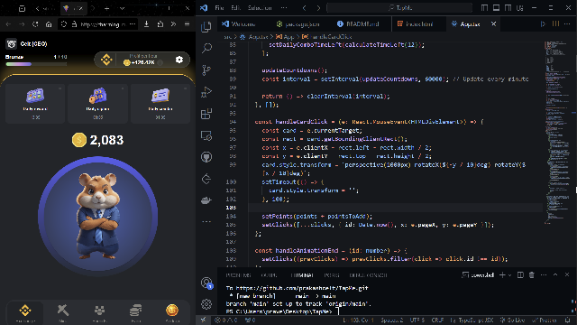

<h2>TapMe</h2>

Welcome to TapMe! This repository contains both the initial setup and the final version of the TapMe app—a clone of the popular Telegram mini-game.Whether you're looking to explore the foundation or dive into the complete app, this repository provides everything you need.
🌟 Overview

The TapMe project provides two branches:

    Initial Setup: A foundational structure with essential assets, images, and icons to start building.
    Final Version: The fully developed application with all features and gameplay mechanics.

🚀 Getting Started

To get started, follow the instructions below based on the branch you'd like to explore.
1. Clone the Repository

Begin by cloning the repository to your local environment:

bash

git clone https://github.com/prakashcelt/TapMe.git

2. Choose Your Branch

Switch between the initial-setup or final-version branches as per your preference.
Initial Setup

To explore the initial project setup:

bash

# Switch to the initial setup branch
git checkout initial-setup

Final Version

To view the fully built version of the app:

bash

# Switch to the final version branch
git checkout final-version

3. Install Dependencies

Once you're in the correct branch, install the required packages:

bash

npm install

4. Run the Development Server

After installing the dependencies, run the server:

bash

npm run dev

5. Open in Browser

Navigate to http://localhost:3000 in your browser to view the app—either the initial setup or the final version, depending on the branch you selected.
🛠️ Tech Stack

    Frontend: React, TailwindCSS
    Game Logic: JavaScript

📂 Repository Structure

    Assets: Contains all the necessary images, icons, and media for the game.
    Initial Setup: Basic skeleton of the app, including assets and configuration.
    Final Version: Fully functional app with click-based game mechanics.

🎮 Features

    Click-to-play: Simple game mechanics that reward players for clicks, inspired by Hamster Kombat.
    Smooth Animations: Engaging user experience with interactive visuals and sound effects.
    Progress Comparison: Compare the development from initial setup to final product.

🖼️ Screenshots

Final Version

📝 License

This project is licensed under the MIT License.

By following the steps above, you can explore both the basic setup and the fully built version of TapMe. Happy coding!